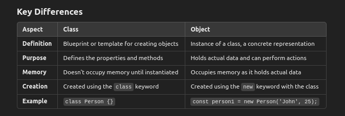

# ✰ Object-Oriented Programming (OOP)


## What is Object-Oriented Programming (OOP)?

Ans : Object-Oriented Programming (OOP) is a programming paradigm or pattern that uses "objects" to design and structure software applications.

These objects represent real-world entities or concepts and are instances of "classes," which act as blueprints for creating objects.

The key principles of OOP are:

1.**Encapsulation** :

Encapsulation is the concept of bundling data (variables) and methods (functions) that manipulate the data into a single unit called a class. It restricts direct access to those data and prevent data misuse.

Example: In a Car class, attributes like speed and color are private, and you access them through public methods like accelerate() or getColor().

**2.Abstraction** : Abstraction is the concept of hiding complex implementation details and showing only the necessary features.
It allows you to interact with an object through a simplified interface without worrying about internal complexities.

Example: A CoffeeMachine class might have a method makeCoffee(), which you can use without needing to know the internal mechanics of coffee making.

**3.Inheritance :**

Inheritance is a mechanism that allows one class (child or subclass) to inherit attributes and methods from another class (parent or superclass)

Example : A Vehicle class can have subclasses like Car and Bike that inherit common features such as speed and fuel, while also having their unique attributes.

**4.Polymorphism**: 

Polymorphism allows methods or functions to take on different forms. It means that you can have multiple methods with the same name but different implementations.

It can be achieved through method **overloading (same method name with different parameters)**

and method **overriding (subclass providing a specific implementation of a method inherited from a parent class)**.

## What is an object in JavaScript? How do you create one?

Ans : In JavaScript, an object is a collection of key-value pairs, where each key is a string (known as a property) and the value can be of any data type (number, string, array, function, another object, etc.)

#### Creating an Object in JavaScript

**1.Object Literal Syntax**

```
const person = {
    firstName: "John",
    lastName: "Doe",
    age: 30,
    greet: function() {
        console.log(`Hello, my name is ${this.firstName} ${this.lastName}`);
    }
};

```

**2.new Object() Constructor**

```
const person = new Object();
person.firstName = "John";
person.lastName = "Doe";
person.age = 30;
person.greet = function() {
    console.log(`Hello, my name is ${this.firstName} ${this.lastName}`);
}

```

**3.Using a Constructor Function**

```
function Person(firstName, lastName, age) {
    this.firstName = firstName;
    this.lastName = lastName;
    this.age = age;
    this.greet = function() {
        console.log(`Hello, my name is ${this.firstName} ${this.lastName}`);
    };
}

const person1 = new Person("Alice", "Smith", 25);
const person2 = new Person("Bob", "Johnson", 40);

```

**4.Object.create()**

```
const animalPrototype = {
    speak() {
        console.log(`${this.name} makes a sound.`);
    }
};

const cat = Object.create(animalPrototype);
cat.name = "Whiskers";
cat.speak(); // Output: Whiskers makes a sound.

```

**5.class Syntax (ES6+)**

```
class Animal {
    constructor(name, type) {
        this.name = name;
        this.type = type;
    }
    
    speak() {
        console.log(`${this.name} is a ${this.type} and says hello!`);
    }
}

const dog = new Animal("Buddy", "Dog");
dog.speak(); // Output: Buddy is a Dog and says hello!

```

## What are classes in JavaScript?

Ans : In JavaScript, classes are a template for creating objects.

They provide a way to define object blueprints with properties and methods.

Syntax for JavaScript Classes

```
class Person {
  // Constructor is called when a new instance of the class is created
  constructor(name, age) {
    this.name = name; // 'this' refers to the instance of the class
    this.age = age;
  }

  // Method of the class
  greet() {
    console.log(`Hello, my name is ${this.name} and I'm ${this.age} years old.`);
  }
}

// Creating an instance of the class
const person1 = new Person('Alice', 30);

// Calling a method on the instance
person1.greet(); // Output: Hello, my name is Alice and I'm 30 years old.

```

## What are the Key Components of JavaScript Classes?

1.**Constructor**
A special method called when a new instance of the class is created. It is typically used to initialize object properties

```
constructor(parameter1, parameter2) {
  this.property1 = parameter1;
  this.property2 = parameter2;
}
```

2.**Methods**
Methods are functions that are defined within a class. They can be used to perform actions or manipulate data within the class.

```
greet() {
  console.log(`Hello, my name is ${this.name} and I'm ${this.age} years old.`);
}
```

3.**Instance**  An object created using the class blueprint.

```
const instance = new MyClass();
```

4.**Inheritance**  A class can inherit properties and methods from another class using the extends keyword.

```
class Animal {
  constructor(name) {
    this.name = name;
  }
  speak() {
    console.log(`${this.name} makes a noise.`);
  }
}

// Dog inherits from Animal
class Dog extends Animal {
  speak() {
    console.log(`${this.name} barks.`);
  }
}

const dog = new Dog('Buddy');
dog.speak(); // Output: Buddy barks.
```

5.**Static Methods** Methods that belong to the class itself and not to instances. They are defined using the static keyword.

```
class MathUtils {
  static add(num1, num2) {
    return num1 + num2;
  }
}
MathUtils.add(2, 3); // Output: 5
``` 
## What is the difference between a class and an object?

Ans :

## How do you create an instance of a class in JavaScript?

Ans : To create an instance of a class in JavaScript, you use the new keyword followed by the class name and pass any necessary arguments to the class's constructor.

## What is a constructor function?

Ans : A special method called when a new instance of the class is created. 
It is typically used to initialize object properties by initial state of the object by assigning value.

 In a single class there should be ***only one constructor*** function.

## What is the this keyword in JavaScript? How does it behave inside a class?

Ans:  The this keyword in JavaScript is a special object that refers to the context in which a function or block of code is executed.

- Its value depends on where it is used, how a function is called, and the scope it is in.

- The behavior of this can vary, but inside a class, this typically refers to the instance of the class being created.(means the object)


| **Scope**                          | **Description**                                                                                                                                                 | **Value of `this`**                                                                                                                                                                        | **Example**                                                                                                                                                     |
|-----------------------------------|-----------------------------------------------------------------------------------------------------------------------------------------------------------------|---------------------------------------------------------------------------------------------------------------------------------------------------------------------------------------------|----------------------------------------------------------------------------------------------------------------------------------------------------------------|
| **Global Context**                 | Outside any function or class. In the global execution context.                                                                                                | In non-strict mode: the global object (`window` in browsers). In strict mode: `undefined`.                                                                                                 | ``` javascript\nconsole.log(this); // In browser, 'this' refers to 'window'.\n ``` |
| **Object Method**                  | Inside a method defined within an object.                                                                                                                      | Refers to the object that the method belongs to.                                                                                                                                           | ```javascript\nconst obj = { name: 'Alice', greet() { console.log(this.name); } };\nobj.greet(); // 'this' is 'obj', Output: Alice\n```                        |
| **Function (Regular Function)**    | Inside a regular function. Not called as a method.                                                                                                             | In non-strict mode: the global object (`window` in browsers). In strict mode: `undefined`.                                                                                                 | ```javascript\nfunction myFunction() { console.log(this); }\nmyFunction(); // In non-strict: 'this' is 'window'. In strict: 'undefined'.\n```                |
| **Arrow Function**                 | Inside an arrow function. Arrow functions do not have their own `this`; they inherit from the enclosing lexical scope.                                         | Inherits `this` from the surrounding lexical context.                                                                                                                                      | ```javascript\nconst arrowFunc = () => { console.log(this); };\narrowFunc(); // Inherits 'this' from the surrounding context.\n```                           |
| **Class (Constructor)**            | Inside a constructor function in a class.                                                                                                                      | Refers to the instance of the class being created.                                                                                                                                         | ```javascript\nclass Person { constructor(name) { this.name = name; } }\nconst person = new Person('Bob');\nconsole.log(person.name); // Output: Bob\n```   |
| **Class (Method)**                 | Inside a method defined in a class.                                                                                                                            | Refers to the instance of the class that called the method.                                                                                                                                | ```javascript\nclass Car { start() { console.log(this); } }\nconst myCar = new Car();\nmyCar.start(); // 'this' is 'myCar' instance.\n```                   |
| **Event Handler (DOM)**            | In an event handler (e.g., attached to a DOM element), `this` refers to the element that the event is attached to.                                            | Refers to the DOM element that triggered the event.                                                                                                                                         | ```javascript\ndocument.getElementById('myBtn').addEventListener('click', function() { console.log(this); }); // 'this' is the clicked button element.\n``` |
| **`call`, `apply`, `bind`**        | When using methods like `call`, `apply`, or `bind` to explicitly set the value of `this`.                                                                      | `this` is explicitly set to the first argument of `call`, `apply`, or `bind`.                                                                                                             | ```javascript\nfunction greet() { console.log(this.name); }\nconst user = { name: 'Alice' };\ngreet.call(user); // 'this' is 'user'. Output: Alice\n```      |
| **IIFE (Immediately Invoked)**     | Inside an Immediately Invoked Function Expression.                                                                                                             | In non-strict mode: the global object (`window` in browsers). In strict mode: `undefined`.                                                                                                 | ```javascript\n(function() { console.log(this); })(); // In non-strict: 'this' is 'window'. In strict: 'undefined'.\n```                                    |
| **Callback Function**              | Inside a callback function, if not bound or not an arrow function.                                                                                             | Depends on how the callback is called. Often `undefined` or the global object in non-strict mode unless context is set explicitly.                                                        | ```javascript\nsetTimeout(function() { console.log(this); }, 1000); // 'this' is 'window' in browsers (or 'undefined' in strict mode).\n```                 |

**Key Takeaways**
 - Global Context: this refers to the global object (or undefined in strict mode).
 - Object Method: this refers to the object containing the method.
- Regular Function: In non-strict mode, this is the global object; in strict mode, this is undefined.
- Arrow Function: this is inherited from the lexical (surrounding) context.
- Class Constructor/Method: this refers to the instance of the class.
- Event Handler: this refers to the DOM element that triggered the event.
- call, apply, bind: You can explicitly control this.

 ## What is the prototype in JavaScript? How does it relate to inheritance?

 Ans : 
 - In JavaScript, a prototype is a mechanism by which objects can inherit features from one another.

- Every JavaScript object has an internal property called [[Prototype]], which refers to another object (or null)

- This other object is called the prototype, and it acts as a blueprint for the original object

- If a property or method is not found on the object itself, JavaScript will look for it in the prototype. This process is known as prototype chaining.


```
// Creating a constructor function
function Person(name) {
  this.name = name;
}

// Adding a method to the prototype of Person
Person.prototype.sayHello = function() {
  console.log(`Hello, my name is ${this.name}`);
};

// Creating a new object using the Person constructor
const person1 = new Person('Alice');

// Accessing the inherited method
person1.sayHello(); // Output: Hello, my name is Alice

```

- In the example above:

The Person function is a constructor, and its prototype is Person.prototype.

The method sayHello is added to Person.prototype, so any object created using the Person constructor will inherit this method.

When person1.sayHello() is called, JavaScript looks for the sayHello method on person1. Since it's not there, it follows the prototype chain to Person.prototype and finds it.


## What is [[Prototype]]?

Ans : In JavaScript:

- Every object has a hidden or internal property called [[Prototype]].

 - This [[Prototype]] is essentially a reference (a pointer) to another object.

 - This other object is called the prototype.

## What is Prototype Chaining?

Ans : 
- Prototype chaining is the mechanism by which JavaScript objects inherit properties and methods from their prototypes through a chain of references.

-  When you try to access a property on an object, JavaScript will look for that property on the object itself. If it's not there, it follows the [[Prototype]] link to the next object (the prototype)

- If the property is still not found, it continues up the chain until it either finds the property or reaches the end of the chain, which is null.


```
Object -> [[Prototype]] -> Prototype Object -> [[Prototype]] -> ... -> null

```

## What is  Prototypal Inheritance Work?

Ans :Ans : Prototypal Inheritance is a feature in JavaScript that allows objects to inherit properties and methods from other objects. 

Instead of using classes like traditional Object-Oriented Programming (OOP) languages (e.g., Java or C++), JavaScript uses prototypes to implement inheritance. 

This means that JavaScript objects can be linked to other objects, and they can inherit properties and behaviors from them.

How it works:

**EXPLAIN Prototype Chaining**

## What is the difference between a prototype and an instance?

Asn :

**Prototype** : 
A prototype is an object that is used as a blueprint or template for creating new objects. It contains the properties and methods that are shared by all instances of a class.

**Instance** : 
An instance is an object that is created using the constructor function and inherits properties and methods from its prototype.

## What is __proto__?

Ans : 

- __proto__ is a property that exists on every object and provides a way to access or set the object's internal [[Prototype]].

- It's not the same as prototype. Instead, it's a reference to the object’s prototype.

- The __proto__ property allows you to navigate up the prototype chain, as it's a direct reference to the object's prototype.


```
const animal = {
  eats: true
};

const rabbit = {
  jumps: true
};

// Setting 'animal' as the prototype of 'rabbit' using __proto__
rabbit.__proto__ = animal;

console.log(rabbit.jumps); // Output: true (direct property of rabbit)
console.log(rabbit.eats);  // Output: true (inherited from animal)

```

## Difference Between __proto__ and prototype?

Ans : 

**__proto__:**

- A property available on every object.
- Points to the object's prototype.
- Used to get or set the prototype of an object.
- Considered a legacy feature but still widely supported.

**prototype:**

- A property only found on constructor functions (like function Person() {}).
- It is an object that will be assigned as the __proto__ of instances created by that constructor function.
- Defines properties and methods that will be inherited by all instances created with that constructor.

## What are getters and setters in JavaScript?

Ans : 

- Getters and setters in JavaScript are special methods that allow you to define how to access and modify the properties of an object.

 **Getters (get)**

 - A getter is a method that gets the value of a property

 - It acts like a regular property but can perform additional operations when the property is accessed.

 - Getters allow you to access computed properties or control how a property is retrieved without changing how you access it.

 ```
const person = {
  firstName: 'John',
  lastName: 'Doe',

  // Getter method to compute fullName
  get fullName() {
    return `${this.firstName} ${this.lastName}`;
  }
};

console.log(person.fullName); // Output: John Doe

 ```

**Setters (set)**

- A setter is a method that sets the value of a property.

- It allows you to execute additional code when a property is changed.

- Setters enable validation or transformation of data before assigning it to a property.

```
const person = {
  firstName: 'John',
  lastName: 'Doe',

  // Setter method to change firstName and lastName from a single string
  set fullName(name) {
    const parts = name.split(' ');
    this.firstName = parts[0];
    this.lastName = parts[1];
  }
};

// Using the setter to change both firstName and lastName
person.fullName = 'Jane Smith';

console.log(person.firstName); // Output: Jane
console.log(person.lastName);  // Output: Smith

```
**Why Use Getters and Setters?**

Encapsulation: Getters and setters allow you to hide the internal implementation of how a property is stored. You can change the internal logic without affecting the external interface.

Validation: Setters enable validation of data before storing it. For example, you can prevent invalid values from being assigned to a property.

Computed Properties: Getters allow you to create properties that are computed dynamically based on other properties, without requiring additional method calls.

Control Access: You can control how properties are accessed or modified, adding extra logic if necessary.


## What is method overriding in JavaScript?

Ans : Method overriding in JavaScript is a concept where a child class or a subclass provides a specific implementation of a method that is already defined in its parent class or superclass. This allows the subclass to change the behavior of the inherited method without modifying the parent class.


```
// Parent class
class Animal {
  speak() {
    console.log('The animal makes a sound.');
  }
}

// Child class (subclass) that inherits from Animal
class Dog extends Animal {
  // Overriding the speak method
  speak() {
    console.log('The dog barks.');
  }
}

const genericAnimal = new Animal();
genericAnimal.speak(); // Output: The animal makes a sound.

const myDog = new Dog();
myDog.speak(); // Output: The dog barks.

```
## What is method chaining in JavaScript? How is it implemented?

Ans : Method chaining in JavaScript is a technique that allows you to call multiple methods on the same object in a single statement. This is achieved by having each method return the object itself (usually with the this keyword) after performing its operation.

```
class Calculator {
  constructor(value = 0) {
    this.value = value;
  }

  // Add a number to the current value
  add(num) {
    this.value += num;
    return this; // Return the instance for chaining
  }

  // Subtract a number from the current value
  subtract(num) {
    this.value -= num;
    return this; // Return the instance for chaining
  }

  // Multiply the current value by a number
  multiply(num) {
    this.value *= num;
    return this; // Return the instance for chaining
  }

  // Divide the current value by a number
  divide(num) {
    this.value /= num;
    return this; // Return the instance for chaining
  }

  // Get the current value
  getValue() {
    return this.value;
  }
}

// Using method chaining
const calculator = new Calculator();
const result = calculator.add(10).subtract(5).multiply(2).divide(5).getValue();

console.log(result); // Output: 2


```

## What are static methods and properties in JavaScript classes?

Ans : In JavaScript, static methods and static properties are special types of class members that belong to the class itself rather than to instances of the class

```
class MyClass {
  static staticMethod() {
    console.log('This is a static method.');
  }
}

// Calling the static method
MyClass.staticMethod(); // Output: This is a static method.

```

```
class MyClass {
  static staticProperty = 'This is a static property.';
}

// Accessing the static property
console.log(MyClass.staticProperty); // Output: This is a static property.

```

## What is mixin in JavaScript, and how is it used?

Ans : 
- A mixin in JavaScript is a design pattern used to enable the reuse of code across multiple classes or objects without using inheritance.

- Mixins allow you to "mix in" additional properties and methods into a class or object, thereby enhancing its functionality. This is especially useful for sharing functionality among unrelated classes.

**1. Using Functions**

```
// Mixin function
const loggingMixin = {
  log() {
    console.log(`Logging: ${this.name}`);
  },
  error(msg) {
    console.error(`Error in ${this.name}: ${msg}`);
  }
};

// Class that will use the mixin
class User {
  constructor(name) {
    this.name = name;
  }
}

// Function to apply the mixin
function applyMixin(targetClass, mixin) {
  Object.assign(targetClass.prototype, mixin);
}

// Applying the mixin to the User class
applyMixin(User, loggingMixin);

const user = new User('Alice');
user.log(); // Output: Logging: Alice
user.error('An unexpected error occurred.'); // Output: Error in Alice: An unexpected error occurred.

```

**2. Using ES6 Classes**

```
// Mixin class
const LoggingMixin = Base => class extends Base {
  log() {
    console.log(`Logging: ${this.name}`);
  }
};

// Base class
class User {
  constructor(name) {
    this.name = name;
  }
}

// Creating a new class with the mixin
class ExtendedUser extends LoggingMixin(User) {}

const user = new ExtendedUser('Bob');
user.log(); // Output: Logging: Bob

```
**3. Using Object.assign() with Prototypes**

```

// Mixin object
const loggingMixin = {
  log() {
    console.log(`Logging: ${this.name}`);
  }
};

// Base class
class User {
  constructor(name) {
    this.name = name;
  }
}

// Mixing in properties
Object.assign(User.prototype, loggingMixin);

const user = new User('Charlie');
user.log(); // Output: Logging: Charlie

```

## How do you handle multiple inheritance in JavaScript?

**1. Mixins**

```
const CanFly = (Base) => class extends Base {
  fly() {
    console.log("Flying!");
  }
};

const CanSwim = (Base) => class extends Base {
  swim() {
    console.log("Swimming!");
  }
};

class Animal {
  eat() {
    console.log("Eating!");
  }
}

// Apply mixins
class Duck extends CanSwim(CanFly(Animal)) {}

const duck = new Duck();
duck.eat();   // Output: Eating!
duck.fly();   // Output: Flying!
duck.swim();  // Output: Swimming!

```
**2. Composition using Object.assign**

```

const flying = {
  fly() {
    console.log("Flying!");
  }
};

const swimming = {
  swim() {
    console.log("Swimming!");
  }
};

const duck = Object.assign({}, flying, swimming);
duck.fly();   // Output: Flying!
duck.swim();  // Output: Swimming!

```

**3. ES6 Class Mixins with Functional Composition**

```
function compose(...mixins) {
  return (Base) => mixins.reduce((acc, mixin) => mixin(acc), Base);
}

const Duck = compose(CanFly, CanSwim)(Animal);

const duck = new Duck();
duck.fly();   // Output: Flying!
duck.swim();  // Output: Swimming!

```
**4. Delegation/Proxy Approach**

```js
const CanQuack = {
  quack() {
    console.log("Quacking!");
  }
};

const CanWalk = {
  walk() {
    console.log("Walking!");
  }
};

const duck = {
  ...CanQuack,
  ...CanWalk
};

duck.quack(); // Output: Quacking!
duck.walk();  // Output: Walking!

```


## what are thoose oops concept not supported in javascript?
## Is js OOPs language?

