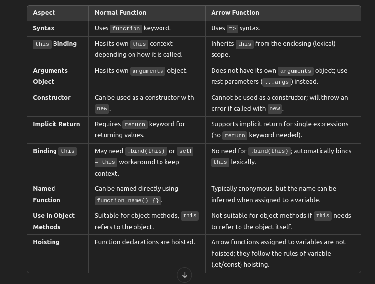

# ✰ Functions in Javascript

## What is a function in JavaScript?

Ans : A function is a block of code that performs a specific task. It can take in input, called parameters, and return output.


## What is the difference between function declarations and function expressions?

Ans : The main difference between function declarations and function expressions in JavaScript is in how they are defined, and how they behave in terms of hoisting.

```
function add(a, b) {
  return a + b;
}
console.log(add(2, 3)); // Output: 5

const add = function(a, b) {
  return a + b;
};
console.log(add(2, 3)); // Output: 5

```

## What is an anonymous function, and where would you use it?

Ans : An anonymous function is a function expression without a name.

```
// Assigned to a variable
const greet = function() {
  console.log("Hello!");
};

// Used as a callback
setTimeout(function() {
  console.log("This is a delayed message.");
}, 1000);

// Immediately Invoked Function Expression (IIFE)
(function() {
  console.log("This runs immediately!");
})();

```

## Explain the concept of Immediately Invoked Function Expressions (IIFE) and provide an example.

Ans: An Immediately Invoked Function Expression (IIFE) is a JavaScript function that is **defined and executed** immediately **after it’s created**

```
(function(name) {
    console.log(`Hello, ${name}!`);
})("Alice");

```

## What are arrow functions, and how do they differ from regular functions?

Ans : Concise syntax for writing functions.

Arraow vs Normal Functions




## What are higher-order functions, and why are they useful?

Ans : 
A higher-order function is a function that either takes one or more functions as arguments, returns a function, or both

***Why Higher-Order Functions Are Useful***

- **Encapsulation of Logic**: By using higher-order functions, you can encapsulate logic into reusable components, making it easy to apply the same function across various data types or collections.

- **Abstraction**: Higher-order functions allow for higher-level abstractions, making the code cleaner and reducing redundancy.

- **Functional Programming**: They support functional programming techniques like mapping, filtering, and reducing data without the need for explicit loops, improving readability and expressiveness.

Example : Map,filter,reduce

***Custom HOF :***

```

// Function that takes a function as an argument and logs its output
function withLogging(fn) {
    return function(...args) {
        const result = fn(...args);
        console.log(`Result: ${result}`);
        return result;
    };
}

// Function to be wrapped by withLogging
const multiply = (a, b) => a * b;

// Wrap the multiply function
const multiplyWithLogging = withLogging(multiply);

// Call the new function
multiplyWithLogging(3, 4); // Output: Result: 12

```

## What is the difference between parameters and arguments in JavaScript functions?

Ans :  Parameters are part of the function declaration; arguments are part of the function call.

```
function greet(name) { // 'name' is a parameter
    console.log(`Hello, ${name}!`);
}

greet("Alice"); // 'Alice' is an argument

```

## How do default parameters work in JavaScript?

Ans : In JavaScript, default parameters allow you to set a default value for function parameters if no argument (or undefined) is provided when the function is called. 

```
function greet(name = "Guest") {
    console.log(`Hello, ${name}!`);
}

greet();           // Output: Hello, Guest!
greet("Alice");    // Output: Hello, Alice!
greet(undefined);  // Output: Hello, Guest!
greet(null);       // Output: Hello, null!

```

## What is currying, and how does it work in JavaScript?

Ans : Currying is a technique in functional programming where a function with multiple parameters is transformed into a sequence of functions, each taking a single argument.

```
function add(a) {
    return function(b) {
        return a + b;
    };
}

// Using the curried function
const addFive = add(5); // Partially applied function
console.log(addFive(10)); // Output: 15
console.log(add(3)(4));   // Output: 7


```