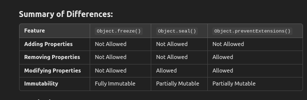

# ✰ Object in Javascript

## what is an Object?
Ans : In JavaScript, an object is a collection of key-value pairs where the keys (also called properties or attributes) are strings or symbols, and the values can be of any data type (such as numbers, strings, arrays, functions, or even other objects). Objects are one of the fundamental data types in JavaScript and are used to store and manage structured data.

## How to create Objects?

Ans : 1.Object Literal Syntax

```
const person = {
    firstName: "John",
    lastName: "Doe",
    age: 30,
    greet: function() {
        console.log(`Hello, my name is ${this.firstName} ${this.lastName}`);
    }
};

```

2.new Object() Constructor

```
const person = new Object();
person.firstName = "John";
person.lastName = "Doe";
person.age = 30;
person.greet = function() {
    console.log(`Hello, my name is ${this.firstName} ${this.lastName}`);
}

```

3.Using a Constructor Function

```
function Person(firstName, lastName, age) {
    this.firstName = firstName;
    this.lastName = lastName;
    this.age = age;
    this.greet = function() {
        console.log(`Hello, my name is ${this.firstName} ${this.lastName}`);
    };
}

const person1 = new Person("Alice", "Smith", 25);
const person2 = new Person("Bob", "Johnson", 40);

```

4.Object.create()

```
const animalPrototype = {
    speak() {
        console.log(`${this.name} makes a sound.`);
    }
};

const cat = Object.create(animalPrototype);
cat.name = "Whiskers";
cat.speak(); // Output: Whiskers makes a sound.

```

5.class Syntax (ES6+)

```
class Animal {
    constructor(name, type) {
        this.name = name;
        this.type = type;
    }
    
    speak() {
        console.log(`${this.name} is a ${this.type} and says hello!`);
    }
}

const dog = new Animal("Buddy", "Dog");
dog.speak(); // Output: Buddy is a Dog and says hello!

```

## General Methods in Object

Ans : source : https://www.w3schools.com/js/js_object_methods.asp

## Object's Property Management Methods?

Ans : source : https://www.w3schools.com/js/js_object_properties.asp

##  Object Protection Methods ?

Ans : https://www.w3schools.com/js/js_object_protection.asp

## Differnce between sealed and frozen and prevent extensions?

Ans : 



## Spread vs Rest parameter in JS?

Ans : 

**Spread Operator**

**Purpose:**:

 - The spread operator is used to expand or spread iterable elements (like arrays or objects) into individual elements.

- Usage: It can be used in function calls, array literals, or object literals , copying of array and object elements.

**Function Calls:**

```
const numbers = [1, 2, 3];
const max = Math.max(...numbers); // spreads elements into individual arguments
console.log(max); // 3
```
**Array Literals or Merging:**

```
const arr1 = [1, 2];
const arr2 = [3, 4];
const combined = [...arr1, ...arr2]; // spreads elements of arr1 and arr2
console.log(combined); // [1, 2, 3, 4]
```
**Object Literals or Merging:**

```
const obj1 = { a: 1, b: 2 };
const obj2 = { b: 3, c: 4 };
const merged = { ...obj1, ...obj2 }; // spreads properties of obj1 and obj2
console.log(merged); // { a: 1, b: 3, c: 4 }

```
Copying of array and object elements:

```
const arr = [1, 2, 3];
const copiedArr = [...arr]; // copies elements of arr
arr.push(4); // modifies original array
console.log(copiedArr); // [1, 2, 3]

const obj = { a: 1, b: 2 };
const copiedObj = { ...obj }; // copies properties of obj
obj.b = 3; // modifies original object
console.log(copiedObj); // { a: 1, b: 2 }
```

**Rest Parameter:**

- The rest parameter is a special parameter that allows you to pass an array or object as multiple arguments and also for destructuring assignment.

```
function sum(...numbers) { // gathers all arguments into an array
    return numbers.reduce((acc, curr) => acc + curr, 0);
}

console.log(sum(1, 2, 3, 4)); // 10

```

```
const [first, ...rest] = [1, 2, 3, 4, 5]; // destructuring assignment
```